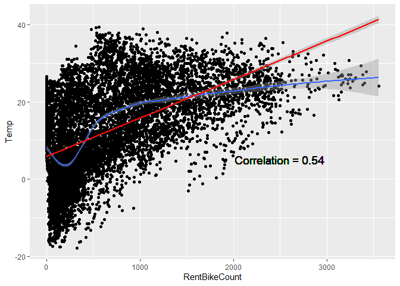

## Programming Questions and Background

What are your thoughts on R vs whatever other software you’ve used? What
functionality do you like about R? What parts do you miss about your
other language? Do you consider R a difficult language to learn?

I think R is quite robust. I’ve only ever touched SQL, SAS, VBA,
Powershell, and Python. It is very similar to Python in how you access
dataframes. There are similar lines of thought in data manipulation
methods as well.

I’ve only worked with Object Oriented coding at a notable level.
Procedural coding I have not gained much expertise in.

I enjoy R’s features that I’ve seen from other languages. Piping from
powershell, and data access methods like Python are quite nice. Although
R is robust and useful, I do miss Python’s vast amount of utility in
creating many different things or applications.

I do not think R is a difficult language to learn. It’s very
straightforward, and although some function arguments don’t always tell
you every option you have, it is well documented with a supporting
community.

My first experience with R was only through the command line as an
alternative method to performing some SAS options. Outside of requests
by professors, most of the time I used it as an incredibly powerful
calculator… limited to the addition and subtraction symbols.

## Iris Plot

``` r
plot(iris)
```



rmarkdown::render(“../\_Rmd/2022-06-09-programming-background.Rmd”,output_format
= “md_document”, output_file =
“2022-06-09-programming-background.Rmd”,output_dir = “../\_posts”,
output_options = list(keep_html=FALSE))

Example R Markdown

\_Rmd
